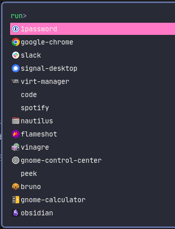
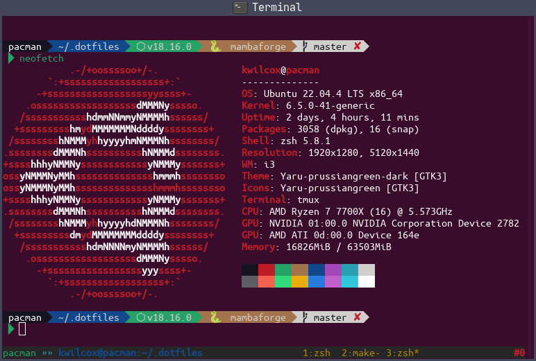
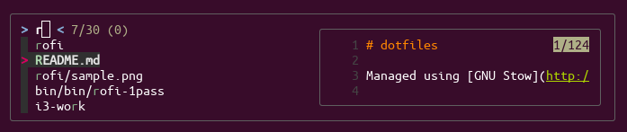
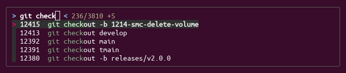

# dotfiles

Managed using [GNU Stow](http://www.gnu.org/software/stow/) with original inspiration from [xero's dotfiles](https://github.com/xero/dotfiles).

## Includes

1. fonts
2. terminal (zsh/tmux)
3. rofi (launcher)
4. dunst (notifications)
5. i3 (wm)

## Installation

1. Clone

    ```shell
    git clone https://github.com/kwilcox/dotfiles.git ~/.dotfiles
    cd ~/.dotfiles
    ```

1. Update submodules

    ```shell
    git submodule update
    ```

1. Install `stow` and `pygmentize`

    ```shell
    # Check your package manager for the correct package name
    [apt|yum|dnf|brew] install stow pygmentize
    ```

1. Install specific dotfile features

    ```shell
    stow [feature]
    ```

## Features

### fonts

Most other configurations rely on some of the fonts in this folder. Install them first!

```shell
stow fonts
sudo fc-cache -f -v
```

### dunst

Theme was made to match the `rofi` theme. By default the notifications appear on the second monitor,
which is a [little thing](https://www.amazon.com/Eyoyo-1920x1080-Computer-Security-Surveillance/dp/B075CGZJLJ/)
that I run under my main monitor. Tested well with Slack, Spotify, Gmail/Calendar, Discord, Signal.

```shell
stow dunst
```


### rofi

Theme is based on Dracula and modified to pop a bit more and match the `i3` theme.

```shell
stow rofi
```



### tmux

Uses [tpm](https://github.com/tmux-plugins/tpm) for plugin management and is configured so
mouse-based and yank-based copying works interchangeably with the system clipboard using [`xsel`](https://github.com/kfish/xsel).

```shell
stow tmux
```

Install plugins: `prefix + I`

Update plugins: `prefix + U`



### fzf

Requires [`fzf`](https://github.com/junegunn/fzf).

```shell
stow fzf
```

#### File browsing/preview (`ctrl+t`)



#### Command browsing (`ctrl+r`)



### nvim

Uses [vim-plug](https://github.com/junegunn/vim-plug) for plugin management. I have migrated to
using `vscode` for my daily coding and this config is a little out of date.

```shell
stow vim
```

Install plugins: `:PlugInstall`

Update plugins: `:PlugUpdate`

### ssh

Uses a config folder at `~/.ssh/config.d` that is included in the main `~/.ssh/config` file. Add
additional SSH config files to this folder and they will be included in the main config file.

```shell
stow ssh
```
